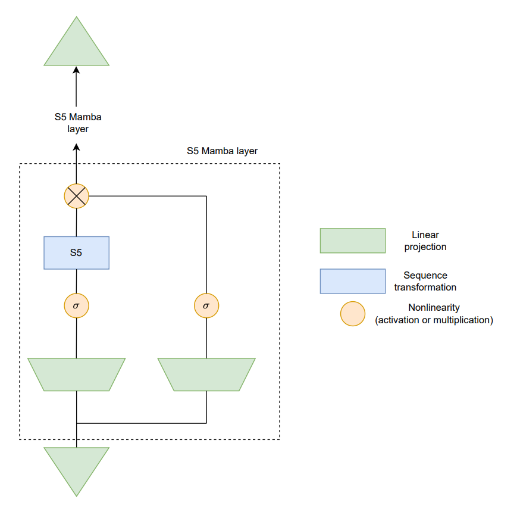

# S5_Mamba_VST3_plugin
a real-time plugin using the [mamba]([https://yytung.notion.site/](https://arxiv.org/abs/2312.00752)) architecture combined with the [S5]([https://yytung.notion.site/](https://arxiv.org/abs/2208.04933)) SSM.

## How to run:
1. install requirements in requirements.txt
1. Download the boss_od3_overdrive.zip [file](https://yytung.notion.site/) (should be boss_od_3_overdrive/overdrive/boss_od3/...) and place it in the main folder.
2. run train.ipynb
3. copy model_weights.json to the plugin folder
4. execute plugin code

